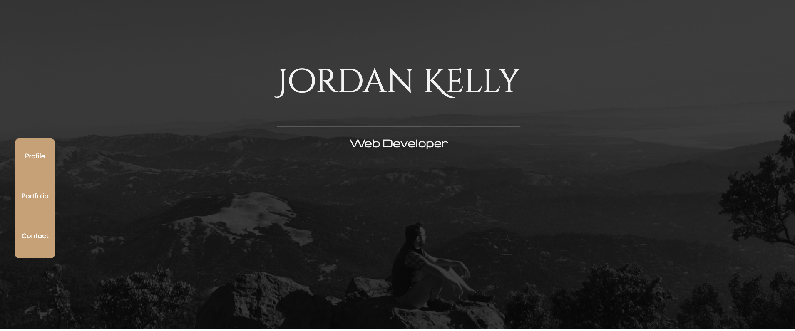
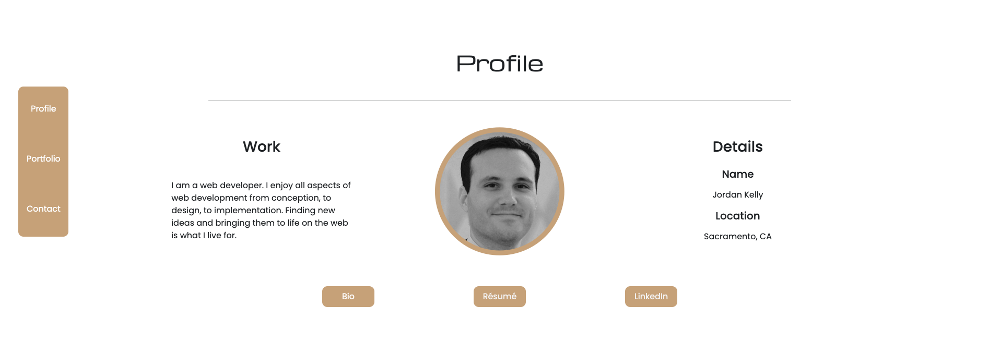
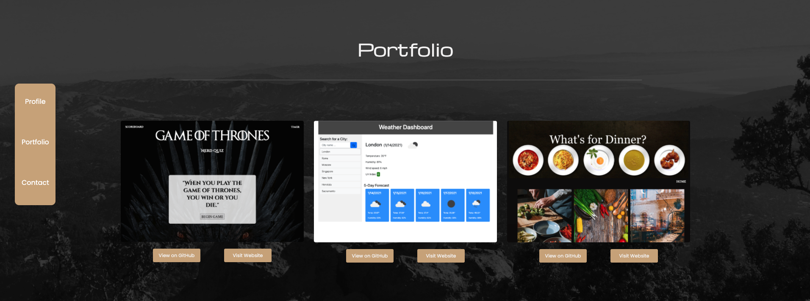

# My Portfolio Webpage

## Table of Contents
* [Project Summary](##project-summary)
* [Technologies Used](##technologies-used)
* [How to Access](##how-to-access)
* [About Me](##about-me)
* [Screenshots](##screenshots)
---

## Project Summary
This is my portfolio website that provides a brief introduction to who I am and what I do. It has a link to a downloadable pdf of my resume, as well as links to my GitHub page, my LinkedIn profile, and examples of past projects I have completed.

## Technologies Used
* [JavaScript](https://developer.mozilla.org/en-US/docs/Web/JavaScript)
* [HTML5](https://developer.mozilla.org/en-US/docs/Web/Guide/HTML/HTML5)
* [CSS3](https://developer.mozilla.org/en-US/docs/Archive/CSS3)

## How to Access
[Portfolio Webpage](https://profjjk.github.io/portfolio/)

## About Me
* [LinkedIn](www.linkedin.com/in/the-real-jordan-kelly)
* [GitHub](https://github.com/profjjk)

## Screenshots

